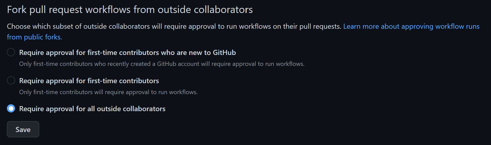

# activate-unity-license

An atomic GitHub Action that activates the Unity Engine license via cli with the provided secret parameters.

Part of the [Mixed Reality Toolkit (XRTK)](https://github.com/XRTK) open source project.

> This action does not require the use of XRTK in your Unity project.

## Related Github Actions

* [xrtk/unity-setup](https://github.com/XRTK/unity-setup) Downloads and installs the unity editor.
* [xrtk/unity-action](https://github.com/XRTK/unity-action) An cli tool for passing commands to the Unity Engine.
* [xrtk/unity-build](https://github.com/XRTK/unity-build) ***(Requires XRTK plugin in Unity Project)***

## How to use

This action uses your stored environment secrets to authenticate with the Unity Licensing servers.

***It's important that you disable other forks of your repository to run actions in pull requests from unknown contributors.***

> Read more on [Approving workflow runs from public forks](
https://docs.github.com/en/actions/managing-workflow-runs/approving-workflow-runs-from-public-forks)

[](https://docs.github.com/en/repositories/managing-your-repositorys-settings-and-features/enabling-features-for-your-repository/managing-github-actions-settings-for-a-repository)

### Setup Secrets

This action requires several secrets that need to be setup in the repository or organization's action secret store.

* `UNITY_USERNAME` The email address you use for your Unity Id
* `UNITY_PASSWORD` The password you use for Unity Id access
* `UNITY_SERIAL` (Required for pro/plus activations)

> Don't forget that pro/plus licenses only support 2 active licenses at a time!

### Create Workflow file

```yml
jobs:
  build:
    runs-on: ${{ matrix.os }}
    strategy:
      #max-parallel: 2 # Use this if you're activating pro license with matrix
      matrix:
        include:
          - os: ubuntu-latest
            build-target: StandaloneLinux64
          - os: windows-latest
            build-target: StandaloneWindows64
          - os: macos-latest
            build-target: StandaloneOSX

    steps:
      - name: checkout self
        uses: actions/checkout@v3

        # Installs the Unity Editor based on your project version text file
        # sets -> env.UNITY_EDITOR_PATH
        # sets -> env.UNITY_PROJECT_PATH
        # https://github.com/XRTK/unity-setup
      - uses: xrtk/unity-setup@v4

        # Activates the installation with the provided credentials
      - uses: xrtk/activate-unity-license@v2
        with:
          # Required
          username: ${{ secrets.UNITY_USERNAME }}
          password: ${{ secrets.UNITY_PASSWORD }}
          # Optional
          serial: ${{ secrets.UNITY_SERIAL }} # Required for pro/plus activations
          license-type: 'Personal' # Chooses license type to use [ Personal, Professional ]
```
